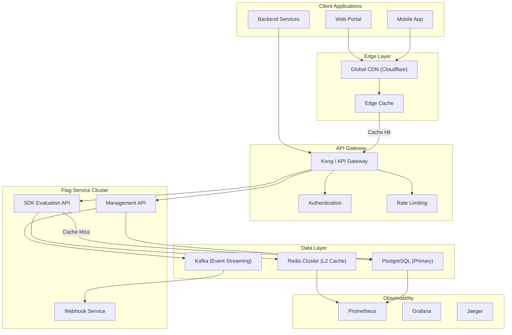
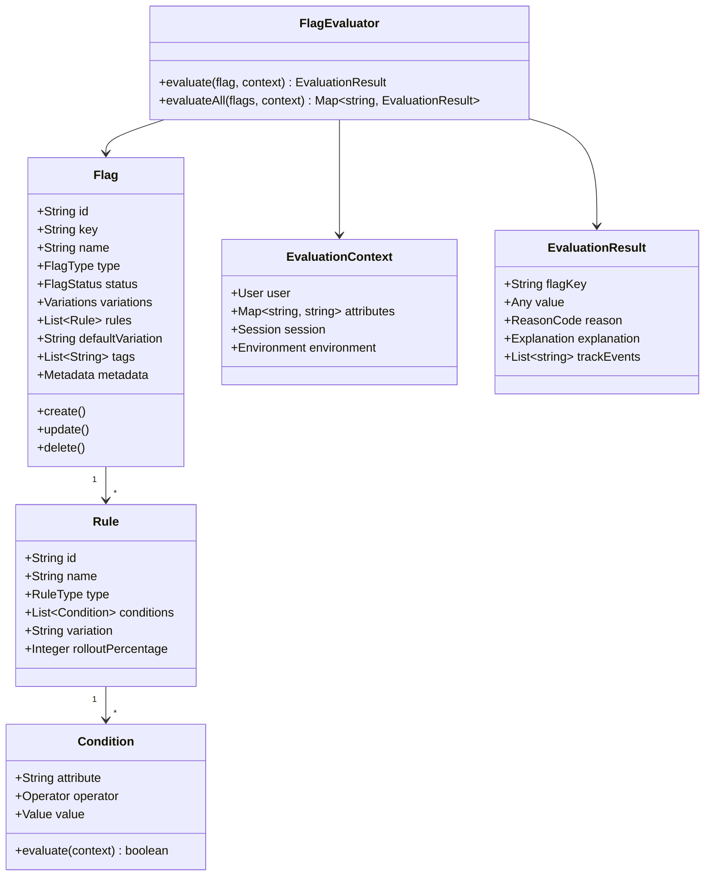
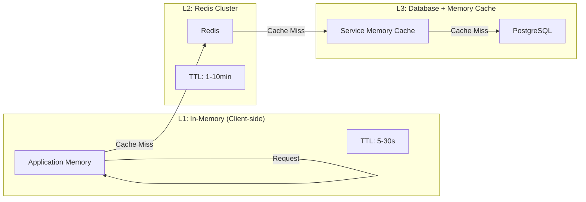
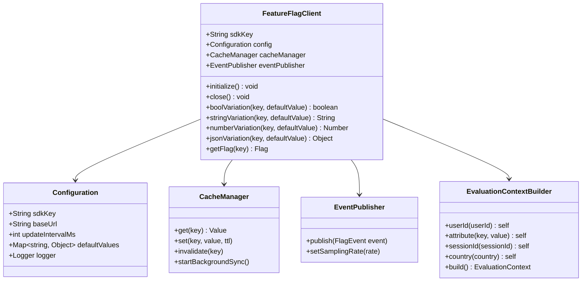
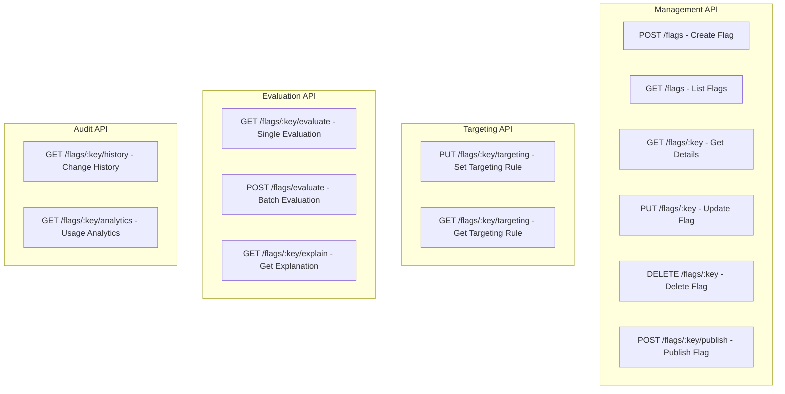
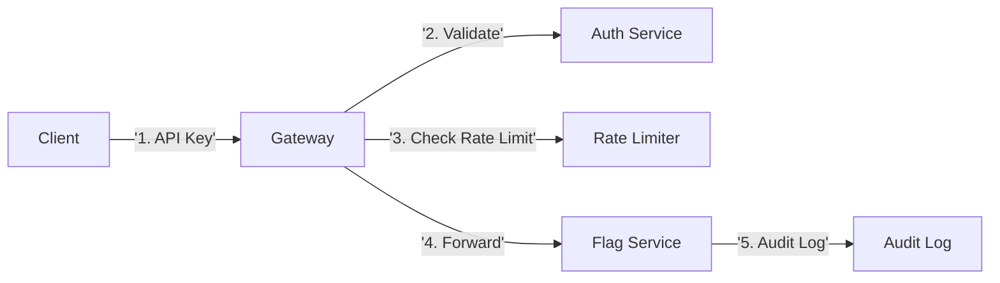
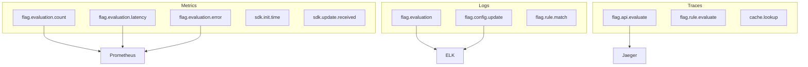
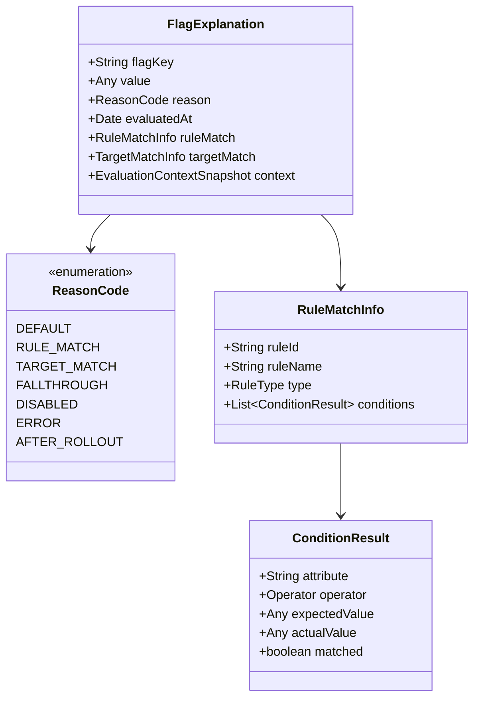
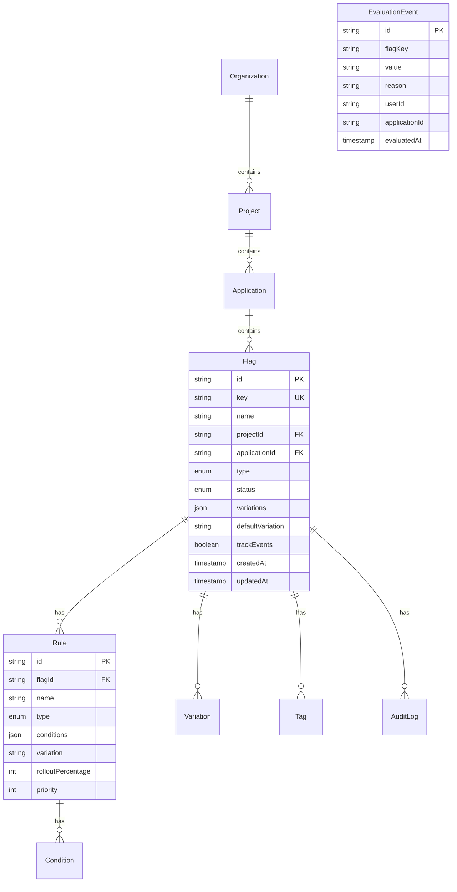
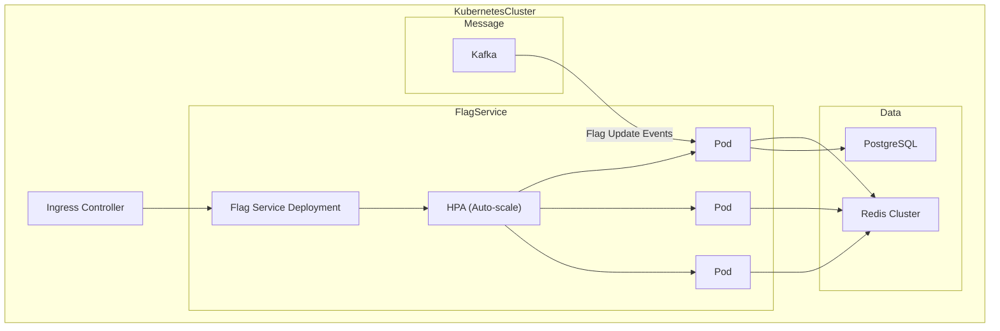

# Feature Management Service Design Plan
[[_TOC_]]
## 1. Overview

## 1.1 Design Goals

Build a high-performance, highly available Feature Flag service for an e-commerce platform, supporting:

- 100+ applications/services
- Thousands of Feature Flags
- High throughput, low latency flag evaluation
- Reasonable resource usage

## 1.2 System Boundaries

```
┌─────────────────────────────────────────────────────────────────────┐
│ Feature Management Service │
├─────────────────────────────────────────────────────────────────────┤
│ Management API │ Evaluation API │ SDK / Client │
│ (Admin use) │ (Runtime evaluation) │ (Integration on all ends) │
└─────────────────────────────────────────────────────────────────────┘
```

## 2. Architecture Design

## 2.1 Overall Architecture Diagram



## 2.2 Core Class Design



## 2.3 Multi-level Cache Architecture



### 2.3.1 Multi-level Cache Strategy

| Level | Technology    | TTL     | Update Mechanism      | Scenario              |
| ----- | ------------- | ------- | --------------------- | --------------------- |
| L1    | Client Memory | 5-30s   | TTL + Pub/Sub invalid | Latency-critical path |
| L2    | Redis Cluster | 1-10min | Pub/Sub invalidation  | Cross-service sharing |
| L3    | CDN Edge      | 5-15min | Polling refresh       | Static config flags   |

### 2.3.2 Cache Invalidation Mechanism

```Java
// Core interface design
public interface CacheInvalidationService {
    // Publish flag update event
    void publishFlagUpdate(FlagUpdateEvent event);

    // Subscribe to flag updates
    void subscribe(FlagUpdateListener listener);

    // Local cache invalidation
    void invalidateLocal(String flagKey);

    // Distributed cache invalidation
    void invalidateRedis(String flagKey);
}
```

### 2.3.3 Cache Optimization Strategies

- Pre-warming: Asynchronously fetch flag config at app startup
- Incremental update: Sync only changed flags to reduce bandwidth
- Batch evaluation: Support batch flag evaluation to reduce network round trips
- Connection pool reuse: Redis connection pooling to reduce connection overhead

## 3. Client SDK Design

### 3.1 SDK Architecture



### 3.2 SDK Usage Example

```typescript
// TypeScript SDK
import { FeatureFlagClient } from "@ecommerce/feature-flag";

// Initialization
const ff = await FeatureFlagClient.init({
  sdkKey: process.env.FEATURE_FLAG_SDK_KEY,
  baseUrl: "https://ff.example.com",
  updateInterval: 5000,
  defaultValues: {
    "new-checkout": false,
    "max-discount-pct": 10,
  },
});

// Basic evaluation
const enabled = ff.boolVariation("new-checkout", false);
const discount = ff.numberVariation("max-discount-pct", 10);

// Contextual evaluation
const result = ff
  .getFlag("new-checkout")
  .withContext({
    userId: "user-123",
    attributes: {
      tier: "premium",
      country: "US",
      release: "v1.0.0",
    },
  })
  .evaluate();

console.log(result.value, result.reason);
```

## 4. API Design

### 4.1 API Overview



### 4.2 Core API Details

- Flag Management API
  Method Path Description
  POST /api/v1/projects/{projectId}/flags Create Flag
  GET /api/v1/projects/{projectId}/flags List Flags (pagination)
  GET /api/v1/projects/{projectId}/flags/{flagKey} Get Flag Details
  PUT /api/v1/projects/{projectId}/flags/{flagKey} Update Flag
  DELETE /api/v1/projects/{projectId}/flags/{flagKey} Delete Flag
  POST /api/v1/projects/{projectId}/flags/{flagKey}/publish Publish Flag
  POST /api/v1/projects/{projectId}/flags/{flagKey}/rollback Rollback Flag

- Flag Evaluation API
  Method Path Description
  GET /api/v1/flags/{flagKey}/evaluate Single Flag Evaluation
  POST /api/v1/flags/evaluate Batch Flag Evaluation
  GET /api/v1/flags/{flagKey}/explain Get Evaluation Explanation
  - Evaluation request example

  ```json
  // POST /api/v1/flags/evaluate
  {
    "flags": ["new-checkout", "discount-promo", "payment-v2"],
    "context": {
      "userId": "user-123",
      "attributes": {
        "tier": "premium",
        "country": "US",
        "device": "mobile"
      },
      "sessionId": "session-456",
      "environment": "production"
    }
  }
  ```

  - Evaluation response example

  ```json
  {
    "results": [
      {
        "flagKey": "new-checkout",
        "value": true,
        "reason": "RULE_MATCH",
        "explanation": {
          "matchedRule": {
            "id": "rule-001",
            "name": "Premium Users Rollout",
            "type": "gradual_rollout"
          },
          "matchedTargets": ["user-123"],
          "evaluatedConditions": [
            {
              "attribute": "user.tier",
              "operator": "EQUAL",
              "value": "premium",
              "result": true
            }
          ]
        },
        "trackEvents": true,
        "evaluatedAt": "2025-03-11T10:30:00Z"
      }
    ]
  }
  ```

### 4.3 API Security Design



- Authentication: API Key (SDK) + JWT (Management)
- Authorization: RBAC (Role-based access control)
- Rate limiting: 1000 evaluations per app per second
- Audit: All management operations are logged

## 5. Observability Strategy

### 5.1 Metrics Collection



### 5.2 Core Metrics

| Metric Name                     | Type      | Description                     |
| ------------------------------- | --------- | ------------------------------- |
| flag_evaluation_total           | Counter   | Total flag evaluations          |
| flag_evaluation_latency_seconds | Histogram | Evaluation latency distribution |
| flag_evaluation_errors_total    | Counter   | Evaluation error count          |
| flag_cache_hit_ratio            | Gauge     | Cache hit ratio                 |
| flag_config_version             | Gauge     | Config version                  |
| sdk_init_duration_seconds       | Histogram | SDK initialization time         |

### 5.3 Log Specification

```json
{
  "timestamp": "2025-03-11T10:30:00.123Z",
  "level": "INFO",
  "service": "flag-service",
  "event": "flag.evaluation",
  "traceId": "abc123",
  "flagKey": "new-checkout-flow",
  "value": true,
  "reason": "RULE_MATCH",
  "context": {
    "userId": "user-123",
    "country": "US"
  },
  "latencyMs": 5,
  "cacheHit": true
}
```

### 5.4 Alert Rules

```yaml
# Prometheus alert rules
groups:
  - name: flag-service
    rules:
      - alert: HighEvaluationErrorRate
        expr: rate(flag_evaluation_errors_total[5m]) > 0.01
        for: 2m
        labels:
          severity: critical

      - alert: HighLatencyP99
        expr: histogram_quantile(0.99, flag_evaluation_latency_seconds) > 0.1
        for: 5m

      - alert: LowCacheHitRatio
        expr: flag_cache_hit_ratio < 0.8
        for: 10m
```

## 6. Explainability Model

### 6.1 Decision Traceability



### 6.2 Explanation Response Example

**GET /api/v1/flags/new-checkout-flow/explain?userId=user-123**

```json
{
  "flagKey": "new-checkout-flow",
  "value": true,
  "reason": "RULE_MATCH",
  "evaluatedAt": "2025-03-11T10:30:00Z",

  "explanation": {
    "rule": {
      "id": "rule-001",
      "name": "Premium Users 50% Rollout",
      "type": "gradual_rollout",
      "rolloutPercentage": 50
    },
    "matchDetails": {
      "matchedTargets": ["user-123"],
      "evaluatedConditions": [
        {
          "attribute": "user.tier",
          "operator": "EQUAL",
          "expectedValue": "premium",
          "actualValue": "premium",
          "matched": true
        },
        {
          "attribute": "user.country",
          "operator": "IN",
          "expectedValue": ["US", "CA", "UK"],
          "actualValue": "US",
          "matched": true
        }
      ],
      "failedConditions": []
    },
    "rolloutInfo": {
      "bucketValue": 42,
      "threshold": 50,
      "matched": true
    }
  },

  "context": {
    "userId": "user-123",
    "attributes": {
      "tier": "premium",
      "country": "US",
      "device": "mobile"
    },
    "environment": "production",
    "sessionId": "session-456"
  },

  "associatedRelease": {
    "releaseId": "release-2025-03-01",
    "name": "March Release",
    "environment": "production",
    "deployedAt": "2025-03-01T00:00:00Z"
  }
}
```

### 6.3 Trace Dimensions

| Dimension   | Description           | Example               |
| ----------- | --------------------- | --------------------- |
| User        | Who triggered eval    | userId, userTier      |
| Region      | Where evaluated       | country, region, city |
| Time        | When evaluated        | timestamp, dayOfWeek  |
| Release     | Associated release    | releaseId, version    |
| Channel     | Through which channel | web, mobile, api      |
| Environment | Which environment     | production, staging   |

## 7. Data Model



## 8. Deployment Architecture

### 8.1 Kubernetes Deployment



### 8.2 Scaling Strategies

- Evaluation API: Auto-scaling based on QPS (CPU > 70% increases Pod count)
- Management API: Manual scaling based on CPU
- Redis: Dynamic scaling based on connection count
- PostgreSQL: Read/write separation + connection pool

## 9. Architecture Trade-off

### 9.1 Cache Strategy: Pull vs Push

```text
┌─────────────────────────────────────────────────────────────────┐
│ Push Mode │
│ Server ──WebSocket/SSE──> Client │
│ ✓ Real-time update │
│ ✗ Complex connection maintenance │
│ ✗ Limited connection count │
│ ✗ Risk of push storm │
└─────────────────────────────────────────────────────────────────┘

┌─────────────────────────────────────────────────────────────────┐
│ Pull Mode (adopted in this design) │
│ Client ──polling──> Server │
│ ✓ Simple and reliable │
│ ✓ Stateless, easy scaling │
│ ✗ Has latency (acceptable, TTL 5-30s) │
└─────────────────────────────────────────────────────────────────┘

┌─────────────────────────────────────────────────────────────────┐
│ Hybrid Mode (optional optimization) │
│ 1. Daily: Pull polling │
│ 2. Important changes: Push notification → Client actively pulls │
└─────────────────────────────────────────────────────────────────┘
```

Design choice: Pull + Pub/Sub invalidation notification, balancing real-time and complexity

### 9.2 Server-side vs Client-side

```text
┌─────────────────────────────────────────────────────────────────┐
│                    Client-side Evaluation                        │
│  Server ──send full flag config──> Client                       │
│  ✓ Ultra-low latency (no network round trip)                    │
│  ✓ Offline available                                            │
│  ✓ No pressure on server                                        │
│  ✗ Config leak (full rules exposed to client)                   │
│  ✗ Distributed computation (hard to control centrally)          │
│  ✗ Complex client implementation                                │
└─────────────────────────────────────────────────────────────────┘

┌─────────────────────────────────────────────────────────────────┐
│                    Server-side Evaluation (adopted in this design) │
│  Client ──send context──> Server → return result                │
│  ✓ Rule confidentiality (server-side decision)                  │
│  ✓ Centralized control (global effect with one change)          │
│  ✓ Simple client                                                │
│  ✗ Network latency                                              │
│  ✗ Server pressure                                              │
└─────────────────────────────────────────────────────────────────┘
```

Trade-off: For e-commerce, rule confidentiality is important (business sensitive), so choose server-side

### 9.3 Storage: Relational vs NoSQL

| Solution            | Advantages                                   | Disadvantages       | Scenario            |
| ------------------- | -------------------------------------------- | ------------------- | ------------------- |
| PostgreSQL (chosen) | Mature, transaction support, complex queries | Limited scalability | Core data, metadata |
| MongoDB             | Flexible schema, easy scaling                | Weak transaction    | Flag config JSON    |
| Redis               | Extremely fast, rich data structures         | Memory cost         | Cache/evaluation    |

Trade-off: Use PostgreSQL as main + Redis as cache, balancing reliability and performance

### 9.4 API Design: REST vs gRPC

```text
┌─────────────────────────────────────────────────────────────────┐
│                    REST API                                       │
│  ✓ Easy integration for browser/all languages                     │
│  ✓ Cache-friendly (GET)                                           │
│  ✓ Easy debugging                                                 │
│  ✗ Slightly lower performance (JSON serialization)                │
│  ✗ Batch operation limitation                                     │
└─────────────────────────────────────────────────────────────────┘

┌─────────────────────────────────────────────────────────────────┐
│                    gRPC                                           │
│  ✓ High performance (Protocol Buffers)                           │
│  ✓ Stream support                                                │
│  ✗ Complex client                                                │
│  ✗ Poor browser support                                          │
└─────────────────────────────────────────────────────────────────┘
```

Design choice:

- Management API: REST (usability first)
- Evaluation API: REST + consider gRPC in future (high performance scenario optional)

### 9.5 Consistency Model: Strong vs Eventual Consistency

```text
┌─────────────────────────────────────────────────────────────────┐
│                    Strong Consistency                            │
│  Each evaluation reads latest config from DB                     │
│  ✗ High latency (each query to DB)                               │
│  ✗ High DB pressure                                              │
└─────────────────────────────────────────────────────────────────┘

┌─────────────────────────────────────────────────────────────────┐
│                    Eventual Consistency (adopted in this design) │
│  Evaluation ──> cache ──> DB (on cache miss)                    │
│  ✓ High performance                                             │
│  ✓ Tolerate short-term inconsistency (seconds)                  │
│  ✗ Short delay for changes                                      │
└─────────────────────────────────────────────────────────────────┘
```

Trade-off: Sacrifice short-term consistency for high throughput and low latency (acceptable for flag changes)
